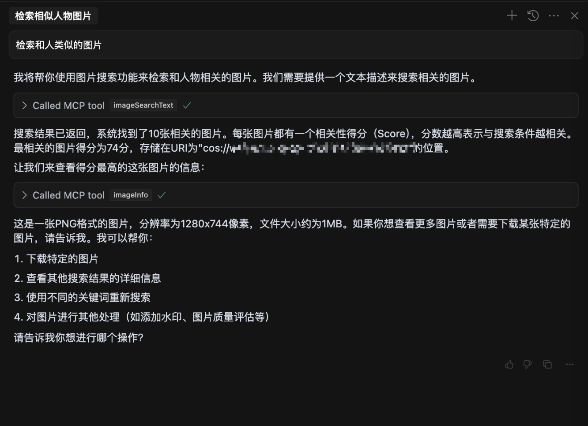

中文 | [English](README.en.md)

# 腾讯云 COS MCP Server 🚀🚀🚀

<p align="center">
  
</p>

基于 MCP 协议的腾讯云 COS MCP Server，无需编码即可让大模型快速接入腾讯云存储 (COS) 和数据万象 (CI) 能力。

---

## ✨ 核心功能

### 云端存储能力
- ⬆️ 文件上传到云端
- ⬇️ 文件从云端下载
- 📋 获取云端文件列表

### 云端处理能力
- 🖼️ 获取图片信息
- 🔍 图片超分辨率
- ✂️ 图片裁剪
- 📲 二维码识别
- 🏆 图片质量评估
- 🅰️ 文字水印
- 🎬 元数据/自然语言检索 (MateInsight)
- 📄 文档转 PDF
- 🎥 视频封面

---

## 💡 典型应用场景

- 使用其他 MCP 能力获取的文本/图片/视频/音频等数据，可直接上传到 COS 云端存储。
- 本地数据快速通过大模型转存到 COS 云端存储/备份。
- 通过大模型实现自动化：将网页里的视频/图片/音频/文本等数据批量转存到 COS 云端存储。
- 自动化将视频/图片/音频/文本等数据在云端处理，并转存到 COS 云端存储。

---

## 🌟 功能示例

1. 上传文件到 COS  
   
2. 图片质量评估  
   
3. 自然语言检索图片  
   
4. 视频截帧  
   

---

# 🔧 安装使用

## 参数说明

为了保护您的数据私密性，请准备以下参数：

### 1. **SecretId / SecretKey**
- **说明**: 腾讯云 COS 的密钥，用于身份认证，请妥善保管，切勿泄露。
- **获取方式**: 
  1. 访问 [腾讯云密钥管理](https://console.cloud.tencent.com/cam/capi)。
  2. 新建密钥并复制生成的 **SecretId** 和 **SecretKey**。

### 2. **Bucket**
- **示例**: `mybucket-123456`
- **说明**: 存储桶名称，用于存放数据，相当于您的个人存储空间。
- **获取方式**: 
  1. 访问 [存储桶列表](https://console.cloud.tencent.com/cos/bucket)。
  2. 复制存储桶名称。如果没有存储桶，可点击“创建存储桶”，一般选择默认配置即可快速完成创建。

### 3. **Region**
- **示例**: `ap-beijing`
- **说明**: 存储桶所在的地域。
- **获取方式**: 
  1. 在 [存储桶列表](https://console.cloud.tencent.com/cos/bucket) 中找到存储桶。
  2. 在存储桶名称一行查看所属地域并复制，例如：`ap-beijing`。

### 4. **DatasetName**
- **说明**: 非必填参数，数据智能检索操作需要此参数。
- **获取方式**: 
  1. 访问 [数据集管理](https://console.cloud.tencent.com/cos/metaInsight/dataManage)。
  2. 创建数据集并等待索引建立完成后，复制数据集名称。

### 5. **connectType**
- **说明**: 非必填参数，指定连接方式，可选值为 `stdio`（本地）或 `sse`（远程）。
- **默认值**: `stdio`

### 6. **port**
- **说明**: 非必填参数，当连接方式为 `sse` 时，可自由设置端口。
- **默认值**: `3001`

---

## 从 npx 启动

在大模型内使用时（例如: cursor），需要在 `mcp.json` 中配置：

```json
{
  "mcpServers": {
    "cos-mcp": {
      "command": "npx",
      "args": [
        "cos-mcp",
        "--Region=yourRegion",
        "--Bucket=yourBucket",
        "--SecretId=yourSecretId",
        "--SecretKey=yourSecretKey",
        "--DatasetName=yourDatasetname"
      ]
    }
  }
}
```

也可以通过 JSON 配置：

```json
{
  "mcpServers": {
    "cos-mcp": {
      "command": "npx",
      "args": [
        "cos-mcp",
        "--cos-config='{\"Region\":\"yourRegion\",\"Bucket\":\"yourBucket\",\"SecretId\":\"yourSecretId\",\"SecretKey\":\"yourSecretKey\",\"DatasetName\":\"yourDatasetname\"}'"
      ]
    }
  }
}
```

---

## 使用 npm 安装

```bash
# 安装
npm install -g cos-mcp@latest

# 运行开启 SSE 模式
cos-mcp --Region=yourRegion --Bucket=yourBucket --SecretId=yourSecretId --SecretKey=yourSecretKey --DatasetName=yourDatasetname --port=3001 --connectType=sse

# 或通过 JSON 配置
cos-mcp --cos-config='{"Region":"yourRegion","Bucket":"BucketName-APPID","SecretId":"yourSecretId","SecretKey":"yourSecretKey","DatasetName":"datasetName"}' --port=3001 --connectType=sse
```

在大模型内使用 SSE 模式时（例如: cursor），需要在 `mcp.json` 中配置：

```json
{
  "mcpServers": {
    "cos-mcp": {
      "url": "http://localhost:3001/sse"
    }
  }
}
```

---

## 使用源码安装

### 步骤 1: 克隆项目代码

```bash
git clone https://github.com/Tencent/cos-mcp.git
cd cos-mcp
```

### 步骤 2: 安装依赖

```bash
npm install
```

### 步骤 3: 启动服务

#### 3.1 配置本地环境变量

创建 `.env` 文件，并配置以下环境变量：

```env
Region='yourRegion'
Bucket='yourBucket'
SecretId='yourSecretId'
SecretKey='yourSecretKey'
DatasetName="yourDatasetName"
```

#### 3.2 本地 SSE 模式启动（方式一）

```bash
npm run start:sse
```

#### 3.3 本地构建后使用 STDIO 模式（方式二）

```bash
npm run build
```

构建产物位于 `dist/index.js`。

---

### 步骤 4: 在大模型内使用

#### SSE 模式配置

```json
{
  "mcpServers": {
    "cos-mcp": {
      "url": "http://localhost:3001/sse"
    }
  }
}
```

#### STDIO 模式配置

```json
{
  "mcpServers": {
    "cos-mcp": {
      "command": "node",
      "args": [
        "${your work space}/dist/index.js"
      ]
    }
  }
}
```

完成以上步骤后，即可通过源码运行 COS MCP Server。

---

## ⚠️ 注意事项

1. 如果安装了旧版本的包，可以将上述内容内 `cos-mcp` 改为 `cos-mcp@latest` 安装最新版包。
2. 如果全局安装后直接使用 `cos-mcp` 不行，可能是全局变量有问题，可以使用拆分变量或 `npx` 的方式启动：
   ```bash
   npm install -g cos-mcp@latest
   cos-mcp --cos-config=xxx --port=3001 --connectType=sse
   ```
   上述命令效果等同于：
   ```bash
   npx cos-mcp@latest --cos-config=xxx --port=3001 --connectType=sse
   ```
3. 如果出现解析问题，可能是终端对双引号敏感，可以将配置参数改为以下格式再尝试：
   ```bash
   --cos-config='{\"Region\":\"yourRegion\",\"Bucket\":\"BucketName-APPID\",\"SecretId\":\"yourSecretId\",\"SecretKey\":\"yourSecretKey\",\"DatasetName\":\"datasetName\"}' --port=3001 --connectType=sse
   ```

---

## 📄 许可证

[](License.txt)